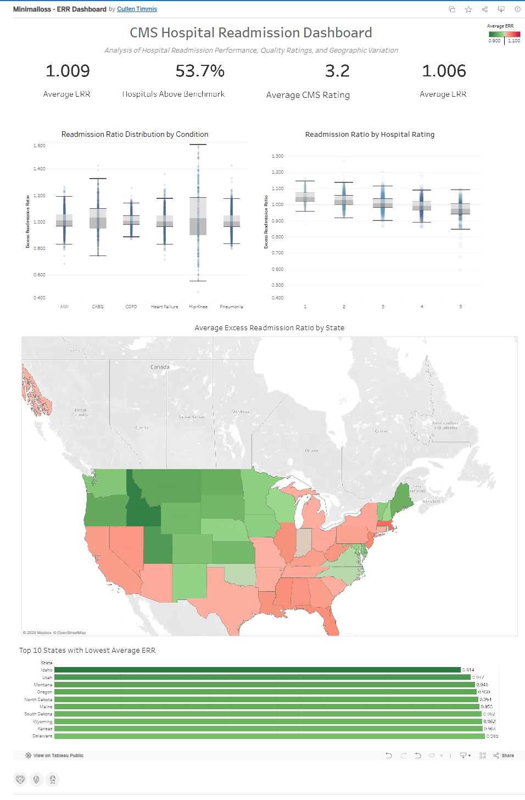

# CMS Hospital Readmission Dashboard

An interactive Tableau dashboard analyzing hospital performance using the Centers for Medicare & Medicaid Services (CMS) Excess Readmission Ratio (ERR) dataset.

## Overview

This project explores variation in hospital readmission performance across the United States and examines the relationship between readmission outcomes and CMS Overall Hospital Ratings.

The dashboard was designed to provide an overview of KPIs, while allowing the user to explore geographic differences and differences in ERR by patient condition.

## Dashboard Features

* KPI summary

  * Average Excess Readmission Ratio (ERR)
  * Percentage of hospitals above the CMS benchmark
  * Average CMS Hospital Rating
  * Highest median ERR across conditions

* Distribution analysis using box plots for:

  * Acute Myocardial Infarction (AMI)
  * CABG
  * COPD
  * Heart Failure
  * Hip/Knee Replacement
  * Pneumonia

* Comparison of CMS Hospital Ratings versus Excess Readmission Ratios

* Interactive choropleth map showing average ERR by state

* Ranking of the top-performing states based on average ERR

## Skills Demonstrated

* Tableau dashboard design
* Healthcare data visualization
* Statistical distribution analysis (box plots)
* Geographic visualization
* Calculated fields
* KPI development
* Dashboard layout and formatting
* Interactive filtering

## Data Source

Centers for Medicare & Medicaid Services (CMS) Hospital Readmissions Reduction Program (HRRP) public data.

## Tableau Public

**Interactive Dashboard:*
https://public.tableau.com/app/profile/cullen.timmis/viz/Minimalloss-ERRDashboard/CMSERRDashboard?publish=yes

## Preview

